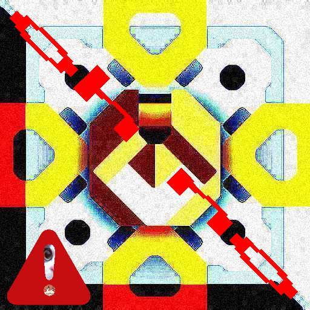

# Extremity
  
Experience Mindustry, in a rather evil way

### Adding Unitdexes to your mod
Extremity, by default, builds it's unitdexes automatically on game start.

However, if your mod doesn't use the default methods of upgrading units, Extremity can fail to generate the entries.  
In such case:
1. Open the game with Extremity enabled.
2. Open the Unitdex Editor and clear the generated Unitdex.
3. Manually create the Unitdex containing missing entries of units from your mod.
4. Export the Unitdex to clipboard.

That should give you the packed Unitdex for your mod;
#### Java
Paste the following code into your mod's main class and replace <unitdex string> with the exported Unitdex

```java
var self = Vars.mods.getMod(getClass());
if(self != null && self.meta != null)
    Core.settings.put("extremity-unitdex-" + self.meta.internalName, "<unitdex string>")
```

#### Kotlin
```kotlin
val self = Vars.mods.getMod(javaClass)
if (self != null && self.meta != null)
    Core.settings.put("extremity-unitdex-" + self.meta.internalName, "<unitdex string>")
```

#### JavaScript / Java (Manual) / Kotlin (Manual)
Pretty much the same as the other two, however you have to manually enter your mod's internal name

```javascript
Core.settings.put("extremity-unitdex-<mod's internal name>", "<unitdex string>")
```